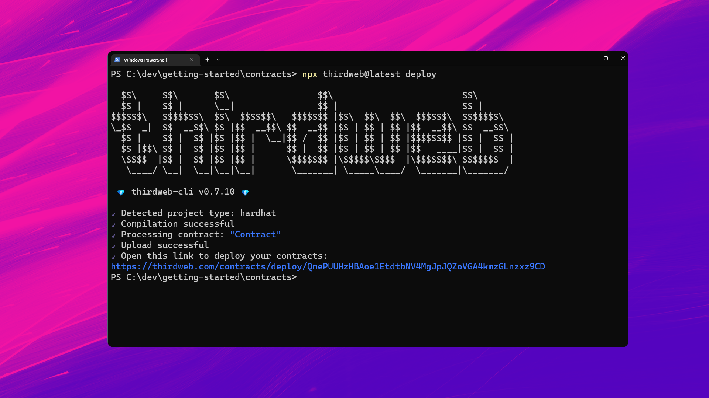
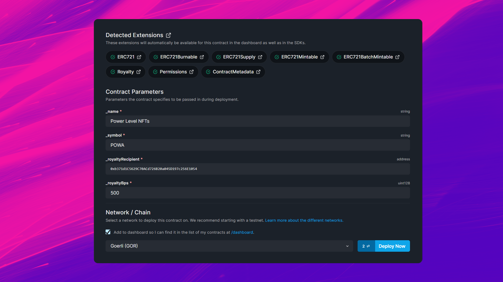
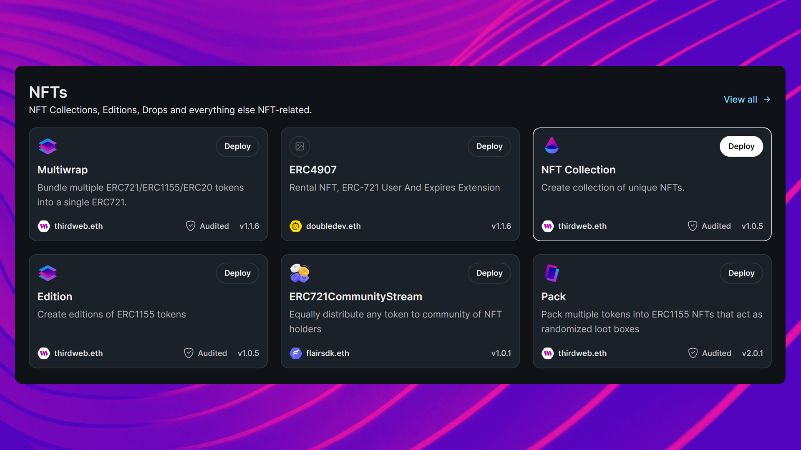
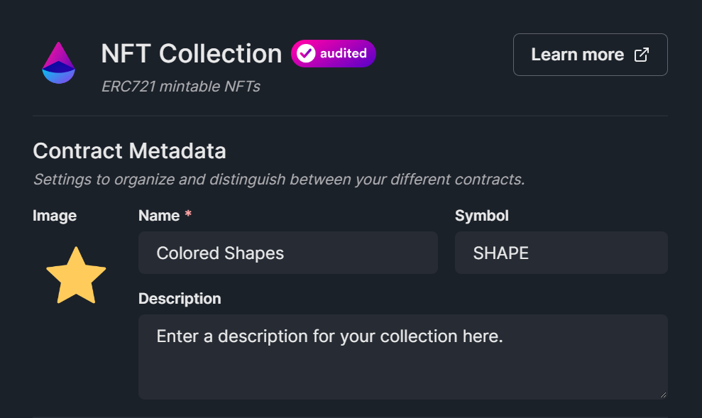
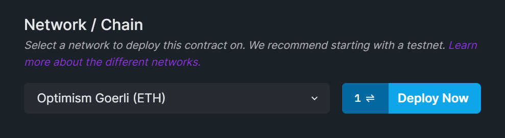

import QuickstartCard from "@components/QuickstartCard";
import TwitterCard from "@components/ShareOnTwitterCard";
import BeginContractJourney from "@components/getting-started/BeginContractJourney";

# 部署一份智能合约

你可能想从头开始构建一份智能合约，
或者部署一个预先构建的解决方案来满足你的需求;
我们为创建和部署任何智能合约提供解决方案。

### 开始你的旅程

从下方选择最能描述你合约需求的卡片。

<BeginContractJourney />

<!-- Selects Custom Contract -->

<div id="custom-contract-section">

<h3>创建项目</h3>

我们可以使用[CLI](/cli)创建一个包含智能合约的新项目，并为我们安装[Solidity SDK](/solidity)。

```bash
npx thirdweb create contract
```

这将开启一系列互动问题，帮助你开启项目:

- 给你的项目起个名字
- 选择[`Hardhat`](https://hardhat.org/)作为框架
- 选择“ERC721”作为[base contract](/solidity/base-contracts/erc721base)
- 可选[extensions](/solidity/extensions)选择“None”

<h3 style={{ marginTop: 48 }}>项目探索</h3>

“create”命令用你的项目名生成一个新目录。在文本编辑器中打开此目录。

在“contracts”文件夹中，你会发现一个“Contract.sol”文件；这是我们用Solidity写的智能合约!

如果我们看一下代码，你可以看到我们的合约通过以下方式继承了[ERC721Base](/solidity/base-contracts/erc721base)的功能:

1. [导入](https://solidity-by-example.org/import/)合约
2. [继承](https://docs.soliditylang.org/en/v0.8.17/contracts.html#inheritance)合约；声明我们的合约是‘ERC721Base’
3. 实现任何[必要方法](/solidity/base-contracts/erc721base#implementing-the-contract)，如“构造函数”[`constructor`](https://docs.soliditylang.org/en/v0.8.17/contracts.html#constructors)。

```solidity title="contracts/Contract.sol"
// SPDX-License-Identifier: MIT
pragma solidity ^0.8.0;

import "@thirdweb-dev/contracts/base/ERC721Base.sol";

contract Contract is ERC721Base {
    constructor(
        string memory _name,
        string memory _symbol,
        address _royaltyRecipient,
        uint128 _royaltyBps
    ) ERC721Base(_name, _symbol, _royaltyRecipient, _royaltyBps) {}
}
```

这种继承模式允许我们在我们的合约中使用来自其他合约的功能，修改它，并添加自定义逻辑。

例如，我们的合约目前实现了[ERC721Base.sol](https://github.com/thirdweb-dev/contracts/blob/main/contracts/base/ERC721Base.sol)合约中的所有逻辑；它通过几个有用的扩展实现了[ERC721A](https://github.com/thirdweb-dev/contracts/blob/main/contracts/eip/ERC721A.sol)标准。

<h3 style={{ marginTop: 48 }}>添加扩展</h3>

[扩展](/solidity/extensions)是向合约中添加个别功能的好方法，比如[权限](/solidity/extensions/permissions)。

你可以遵循与我们对基础合约所做的相同的模式来添加扩展:

**引入**

```solidity
import "@thirdweb-dev/contracts/extension/PermissionsEnumerable.sol";
```

**继承**

```solidity
contract Contract is ERC721Base, PermissionsEnumerable {
    // ...
}
```

**实现**

```solidity
contract Contract is ERC721Base, PermissionsEnumerable {
    constructor(
        string memory _name,
        string memory _symbol,
        address _royaltyRecipient,
        uint128 _royaltyBps
    ) ERC721Base(_name, _symbol, _royaltyRecipient, _royaltyBps) {
        // Give the contract deployer the "admin" role when the contract is deployed.
        _setupRole(DEFAULT_ADMIN_ROLE, msg.sender);
    }

    // Example: Only allow the "admin" role to call this function.
    function helloWorld() external onlyRole(DEFAULT_ADMIN_ROLE) {
        // ...
    }
}
```

大功告成！🥳 你刚刚创建了一个ERC721A NFT集合智能合约，具有权限控制！

<h2 style={{ marginTop: 64 }}>部署</h2>

让我们通过运行以下命令将合约[部署](/deploy)到区块链:

```bash
yarn deploy
```

就是这样！🥳 该命令的作用如下：

- 编译你的合约
- 上传你的合约源代码([ABI](https://docs.soliditylang.org/en/v0.8.17/abi-spec.html))到[IPFS](https://docs.ipfs.tech/concepts/what-is-ipfs/)
- 打开[仪表板](/dashboard)，让你选择要部署到的[支持网络](https://blog.thirdweb.com/guides/which-network-should-you-use/)之一



首先，我们需要输入合约构造函数的值：

- `_name`: 我们合约的名称
- `_symbol`: 给我们的合约代币的符号或“ticker”
- `_royaltyRecipient`: 将从二次销售中接收版税的钱包地址
- `_royaltyBps`: 每次二次销售将给予特许权使用费接受者的**basis points** (_bps_)，例如500 = 5%

最后，选择要部署到_(我们推荐Goerli测试网络)_的[网络](https://blog.thirdweb.com/guides/which-network-should-you-use/)，然后单击“Deploy Now”。



一旦你的合约被部署，你会被重定向到合约的仪表板:

<div className="row" style={{ marginBottom: 16 }}>
  <div className="col col--12" style={{ padding: 8, paddingBottom: 0 }}>
    <QuickstartCard
      name="接下来：欢迎来到你的合约仪表板"
      link="/getting-started/dashboard"
      image="/assets/product/dashboard.png"
    />
  </div>
</div>

</div>

<!-- Selects Prebuilt Contract -->

<div id="prebuilt-contract-section">

<h3>探索合约</h3>

在[探索页面](https://thirdweb.com/explore)，你可以选择由可信的开源协议和thirdweb团队构建的经过精心策划的gas优化、审计和战斗测试的智能合约;一键部署即可。

例如，让我们选择由thirdweb团队构建的 [NFT Collection](https://thirdweb.com/thirdweb.eth/TokenERC721) 智能合约:



从这个页面，我们可以发现合约的特性，查看它的源代码，看看它实现了哪些[扩展](https://portal.thirdweb.com/solidity/extensions)，并将它部署到[我们选择的区块链](https://blog.thirdweb.com/guides/which-network-should-you-use/)。

点击“Deploy Now”按钮进入部署流程，输入你的智能合约元数据；如其名称、符号、图像和描述：



最后，选择你想要部署智能合约的[网络](https://blog.thirdweb.com/guides/which-network-should-you-use/)，然后点击“Deploy Now”:



一旦你的合约被部署，你会被重定向到合约的仪表板:

<div className="row" style={{ marginBottom: 16 }}>
  <div className="col col--12" style={{ padding: 8, paddingBottom: 0 }}>
    <QuickstartCard
      name="接下来：欢迎来到你的合约仪表板"
      link="/getting-started/dashboard"
      image="/assets/product/dashboard.png"
    />
  </div>
</div>
</div>

<!-- Selects Deploy Existing -->

<div id="deploy-contract-section">

<h3>部署智能合约</h3>

使用[CLI](/cli)将智能合约[部署](/deploy)到区块链。

在与智能合约`.sol`文件相同的目录中，运行以下命令:

```bash
npx thirdweb deploy
```

就是这样！🥳 该命令的作用如下：

- 编译你的合约
- 上传你的合约源代码([ABI](https://docs.soliditylang.org/en/v0.8.17/abi-spec.html))到[IPFS](https://docs.ipfs.tech/concepts/what-is-ipfs/)
- 打开[仪表板](/dashboard)，让你选择要部署到的[支持网络](https://blog.thirdweb.com/guides/which-network-should-you-use/)之一


在浏览器中打开生成的URL，填充智能合约的“构造函数”[`constructor`](https://docs.soliditylang.org/en/v0.8.17/contracts.html#constructors)字段

最后，选择要部署到_(我们推荐Goerli测试网络)_的[网络](https://blog.thirdweb.com/guides/which-network-should-you-use/)，然后单击“Deploy Now”。


一旦你的合约被部署，你会被重定向到合约的仪表板:

<div className="row" style={{ marginBottom: 16 }}>
  <div className="col col--12" style={{ padding: 8, paddingBottom: 0 }}>
    <QuickstartCard
      name="接下来：欢迎来到你的合约仪表板"
      link="/getting-started/dashboard"
      image="/assets/product/dashboard.png"
    />
  </div>
</div>
</div>
